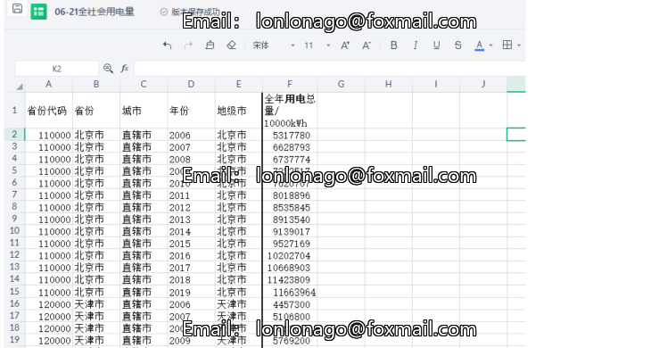

# Tool Variable - Social Electricity Consumption Data Set 06-21.xlsx

188KB XLSX

I. Data Range: Covers over 300 prefecture-level cities in China
II. Inclusion of Indicators:
    Province, Prefecture-Level City, Year, Total Societal Electricity Consumption.
III. Data Source: National Grid inquiry data.
For the vast majority of cities, the grid sales volume is equivalent to the total societal electricity consumption (the sales volume and total societal electricity consumption data from previous years are the same). Additionally, the data within the grid does not include one-half of Inner Mongolia and five provinces of the Southern Power Grid. The remaining data is obtained through local provincial and municipal TJ bureaus, provincial and municipal statistical departments, provincial and municipal economic development monthly reports, and telephone consultation with local TJ bureaus for total societal electricity consumption data.
IV. Example Data:

## Images

Here is a pay link on Stripe ( https://buy.stripe.com/3cs8yP7sY87d0vu9AB ). Please contact me lonlonago@foxmail.com after funding $89, and I will send you a complete data files , thank you!

